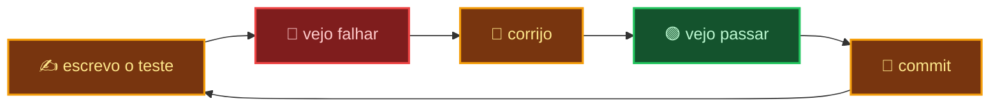

<div align="center">

# 📓 wsmithdiary

### Desenvolvedor · React · TypeScript · Node


**Disponível para remoto**

[](https://linkedin.com/in/SEU-PERFIL)

</div>

---

## 📓 O diário

Escrevo interfaces em React com TypeScript e serviços em Node.

Trabalho com a lógica separada da interface: regra de negócio em TypeScript
puro, testada sem renderizar nada. Escrevo o teste antes e confirmo que ele
falha — teste que nunca falhou não provou nada.

> [!NOTE]
> O nome vem do diário de Winston Smith, em *1984*. Ele escrevia sabendo que
> aquilo poderia ser lido por qualquer um. Este perfil segue a mesma regra:
> aqui fica o que eu sustento em público. O resto é conversa.

<div align="center">

```
COMMIT É MEMÓRIA
TESTE É VERDADE
README É LIBERDADE
```

</div>

---

## 🎯 O que eu entrego

<table>
<tr>
<th>⚙️ Sem consultar nada</th>
<th>📖 Consultando a documentação</th>
</tr>
<tr>
<td>

- Componente React com estado, efeito e `fetch`
- Tipagem em TypeScript no dia a dia
- HTML semântico e CSS com Tailwind
- Branch, commit semântico, fluxo de PR

</td>
<td>

- Suíte de testes com Vitest e Testing Library
- Formulário acessível: `useId`, `aria-describedby`, `role="alert"`
- Modelagem e consulta em PostgreSQL
- Conflito de merge e reescrita de histórico

</td>
</tr>
</table>

> [!TIP]
> **Estudando agora:** segurança ofensiva, redes e arquitetura de aplicação que
> aguenta uso real.

---

## 🔄 Como eu trabalho



No Ministério da Verdade, o registro inconveniente ia para o buraco da memória e
passava a nunca ter existido. `git` não tem buraco de memória — e é por isso que
o histórico serve de currículo.

---

## 🧾 Projeto

<div align="center">

### Gerador de Orçamentos


</div>

Aplicação web que monta orçamento de mão de obra linha a linha, calcula os
totais e exporta o PDF pronto. Sem back-end, sem etapa extra.

**Decisões que eu defendo:**

- 🧮 A regra de negócio vive em `core/`, em TypeScript puro que não importa
  React. A maior parte da lógica é testada sem DOM e sem `act()`.
- 🇧🇷 Campos numéricos são `type="text"` com `inputMode="decimal"`, porque
  `type="number"` recusa a vírgula decimal que o usuário brasileiro digita. A
  conversão acontece na validação, num só lugar.
- 🧼 Validação é função pura: devolve os erros por campo e deixa a decisão com o
  componente.
- ♿ Acessibilidade não é enfeite — é o que faz o formulário ser testável por
  papel e por nome, do jeito que o usuário o enxerga.

<div align="center">

[](https://github.com/wsmithdiary/SEU-REPO)

</div>

---

<div align="center">

## 📡 Contato

Currículo, nome completo e histórico pelo LinkedIn.

[](https://linkedin.com/in/SEU-PERFIL)

<br>

<sub><i>"Quem controla o passado controla o futuro."<br>
Por isso o histórico fica público e o resto não.</i></sub>

</div>
